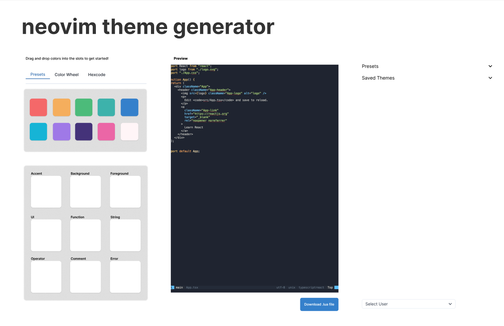

## Neovim Theme Generator

A CISC275 Project by ...

- Brendan Lewis
- Aidan Eyre
- Eli Brignac
- Jonathan Ma

## Figma Mockup

    
## Project Spec

**Super List**: Preset Neovim Themes
**Admin List**: Tentative Neovim Themes to add to the Presets (we will handle
this by routing to a different page on the static website)
**User List**: User saved themes

**Items**: The item are themes that have a preview image, a name, and. a description. The first attribute is a list of hexcode strings, the second attribute is a list of tags (strings) that a user can attach to the theme. The numeric field is the number of likes a theme receives (this is a static website, so this is going to be a dummy variable)

**Super/Admin** users will be able to add Tentative Themes to be reviewed
to the Admin List.

**Super users** will be able to then add or delete items from and to the Super List and Admin List.